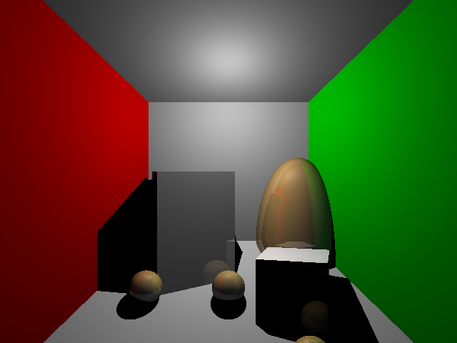

# Simple raytracer based on  San DiegoX: CSE167x Computer Graphics course





# Build
For example using x64 Native Tools Command Prompt for VS 2019:
```
mkdir build
cd build
cmake -G "Visual Studio 16 2019" ..
cmake --build .
```

# Run
```
cd Debug
RayTracer.exe ..\..\scenes\scene6.test
```

# Hotkeys:
F1 - save image to `<name-of-scene>.png` located near executable
